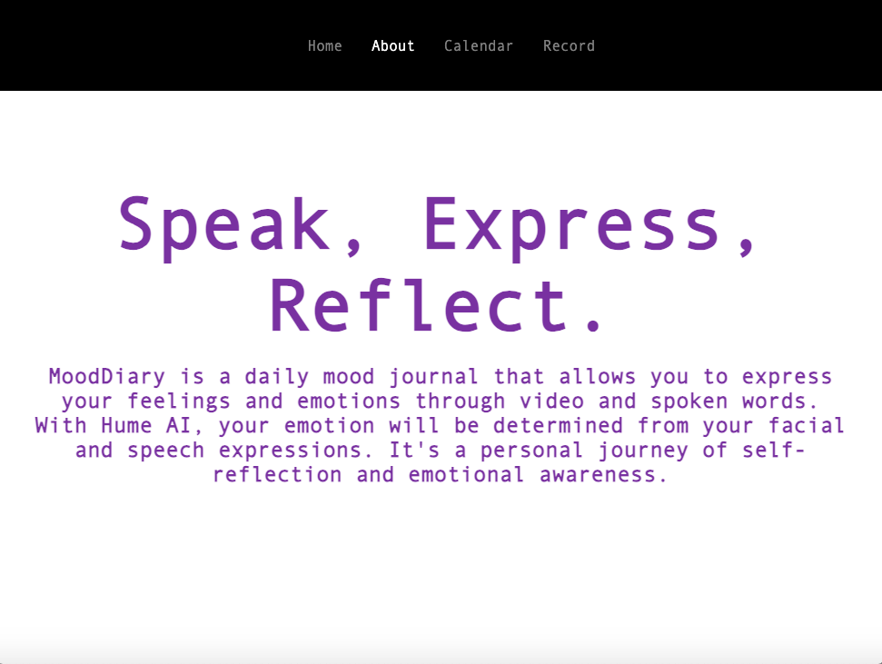

# MoodDiary
### Developed by: Orien Cheng, Emily Ng, Honghui Li

#
## HomePage

## About

## Calendar

*Users can see their daily mood trend visualized on the calendar.*

## Record

*User's video log is analyzed via HumeAI to generate an emotion entry for the day.*

# 

## Inspiration
The inspiration behind MoodDiary came from the desire to revolutionize the concept of personal journaling. Traditional text-based entries can sometimes limit the depth and expression of emotions. We envisioned a platform where users can go beyond words and truly immerse themselves in the experience of capturing their feelings and emotions. By incorporating AI technology to analyze facial and speech expressions, we aimed to enhance self-reflection and emotional awareness.

## What it does
MoodDiary is a daily mood journal that allows users to record their emotions and feelings through video and spoken words. Users can capture a video of themselves and speak about their mood, thoughts, and experiences of the day. Hume AI will then analyze user's facial expressions and speech to determine the dominant emotion expressed. Users can review their past entries and reflect on their emotional journey over time on the calendar.

## How we built it
We built MoodDiary using a combination of web development technologies and AI. The website was developed using HTML, CSS, and ReactJS. We integrated Hume AI's facial and OpenAI's Whisper speech recognition APIs to analyze the user's expressions and extract emotional insights from their videos. The backend utilized a Python to handle API requests and data storage. 

## Challenges we ran into
During the development process, we faced several challenges. Integrating the facial and speech recognition APIs required careful consideration of the data formats and handling real-time analysis. We also had to design and build the website from scratch. Ensuring a seamless user experience while processing and analyzing videos also presented technical hurdles. 

## Accomplishments that we're proud of
We are proud of creating MoodDiary as a platform that combines emotional expression, AI technology, and personal growth. The successful integration of Hume AI and OpenAI APIs into our application has allowed users to gain insights into their emotional states and track their emotional journey over time. We take pride in providing a user-friendly and engaging experience that promotes self-reflection and emotional awareness.

## What we learned
Through the development of MoodDiary, we gained valuable insights into the implementation of facial and speech recognition technologies. We learned about the challenges and considerations involved in capturing and analyzing video data in real-time. Additionally, we gained experience in working with APIs and integrating external services into our application. We also deepened our understanding of UX design and the importance of creating a seamless and intuitive interface.

## What's next for MoodDiary
Moving forward, we have exciting plans for MoodDiary. We aim to refine the AI algorithms further to recognize more emotions. We plan to introduce additional features such as written journal entries, add a Google Calendar plug-in, and add personalized advice and mental health help based on emotional patterns. We also envision integrating social sharing and community features to foster support and connection among MoodDiary users. Our goal is to continue enhancing the user experience and promoting emotional well-being through this innovative journaling platform.